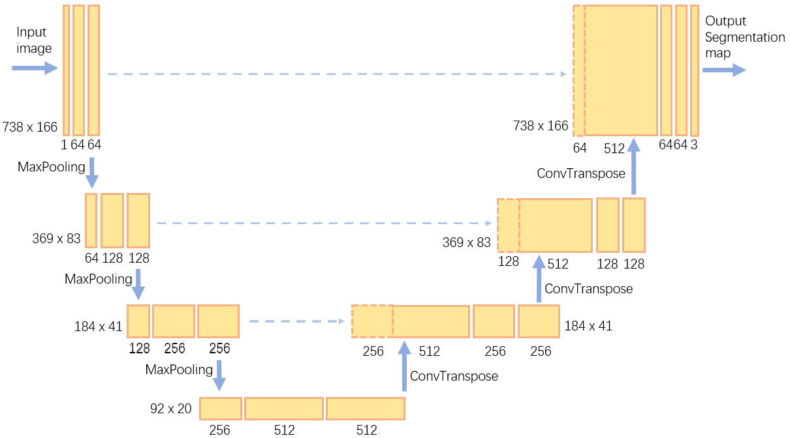

# Image_Segmentation
This project utilizes U-Net to construct a neural network for segmenting the liquid inside the pipes in the images.

The structure of the U-Net:

## Environment
* Python 3.9.16
* TensorFlow 2.6.0
* PyCharm 2022.3.2
* Anaconda 2.1.1
* CUDA v11.2
