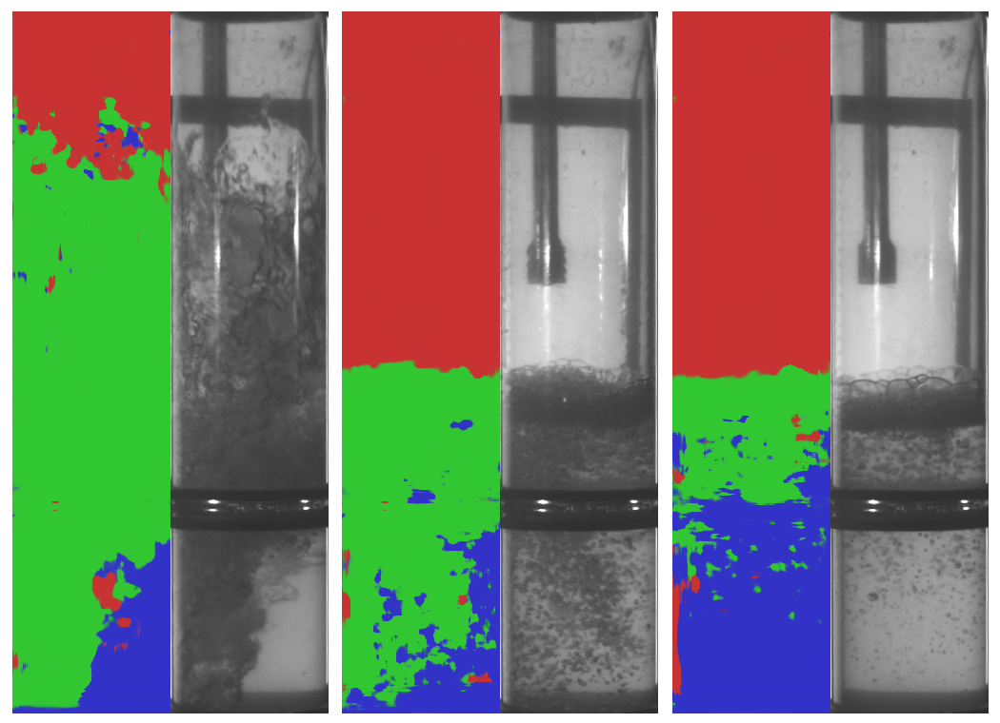
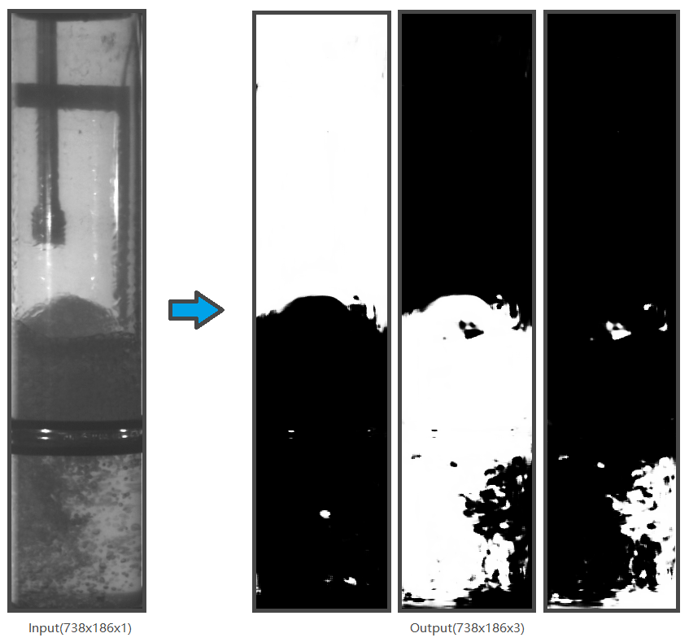

# Image_Segmentation
This project utilizes U-Net to construct a neural network for segmenting the liquid inside the pipes in the images. The liquid inside the pipe is divided into three parts: air, mixture, and water. The model takes a single-channel image of the pipe as input and outputs a three-channel mask image, where each channel corresponds to the three mentioned parts.

# Model Structure
This model takes an input image of size 738x186x1 and outputs a segmentation image of size 738x186x3. The U-NET architecture consists of an Encoder and a Decoder. The Encoder is composed of multiple convolutional layers (represented by Conv2D), which convolve the image to extract different features. These features are then downsampled through pooling operations, reducing the dimensionality and extracting essential image features. By passing the image through multiple convolutional layers, we can transform the image into multiple low-dimensional feature vectors.

During the decoding process, we use deconvolution operations to restore these low-dimensional feature vectors back to high-dimensional image data. During decoding, each step uses the output before pooling from the corresponding encoding step as the condition for decoding, ensuring a strong correlation between the output and input images.

## Environment
* Python 3.9.16
* TensorFlow 2.6.0
* PyCharm 2022.3.2
* Anaconda 2.1.1
* CUDA v11.2
